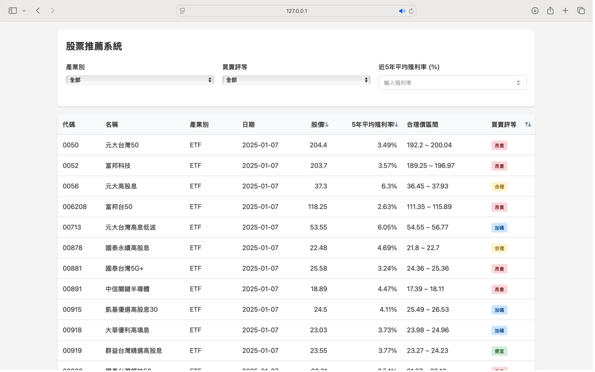

# 股票推薦系統暨自動化交易機器人

## 專案簡介

本專案是一個整合資料庫管理、數據分析和網頁前端技術的股票推薦系統，建立了完整的投資決策輔助平台。系統採用差異化的產業評估模型，針對金融、營建、航運、半導體、電子零組件及ETF等不同產業特性，建立各自相對應的評估邏輯。本系統使用台灣股票市場(台股)的資料進行分析與推薦，適合對台股投資有興趣的使用者。

研究動機：在現今社會中，投資理財已經不再只是專業投資人的領域，而是每個人都應具備的重要知識與能力。然而，對於投資新手來說，投資理財的學習門檻較高，在進場和出場時機的把握上往往感到困惑，經常遇到諸如「買高賣低」、「無法有效評估股票價值」以及「對市場動向判斷失誤」等問題。

## 系統架構

### 三層架構設計
- **前端展示層**: HTML, CSS, JavaScript
- **應用服務層**: Python Flask
- **資料存取層**: PostgreSQL

### 主要功能模組
1. **使用者認證模組**: 負責使用者註冊、登入等身份驗證功能
2. **資料擷取模組**: 負責從外部資料源獲取股票相關數據
3. **資料處理模組**: 處理原始數據，計算價值區間與價值評估
4. **推薦引擎模組**: 根據使用者的選擇，篩選展示相對應的標的

## 資料庫設計

系統使用PostgreSQL資料庫，主要包含以下表格：

### 使用者相關表格
- `users`: 存儲使用者基本資訊

### 產業股票資料表
- `finance_value`: 金融業股票基本面數據
- `construction_value`: 營建業股票基本面數據
- `shipping_value`: 航運業股票基本面數據
- `semiconductor_value`: 半導體業股票基本面數據
- `electronic_components_value`: 電子零組件業股票基本面數據
- `etf_value`: ETF基本面數據

### 股價資料表
- `finance_prices`: 金融業股價數據
- `construction_prices`: 營建業股價數據
- `shipping_prices`: 航運業股價數據
- `semiconductor_prices`: 半導體業股價數據
- `electronic_component_prices`: 電子零組件業股價數據
- `etf_prices`: ETF股價數據

### 整合資料表
- `stock_all_industry_merge`: 所有產業股票的綜合資料

## 推薦系統設計

### 產業差異化評估邏輯

本系統針對不同產業採用不同的評估邏輯：

1. **金融業與營建業**:
   - 評估指標：淨值和本淨比
   - 金融業合理區間：本淨比0.8至1.2倍
   - 營建業合理區間：本淨比0.7至1.1倍

2. **航運業、半導體業和電子零組件業**:
   - 評估指標：本益比(P/E ratio)和每股盈餘(EPS)
   - 航運業合理區間：本益比0.6至0.9倍
   - 半導體和電子零組件合理區間：本益比0.8至1.2倍

3. **ETF類別**:
   - 評估指標：淨值
   - 合理區間：淨值的0.98至1.02倍

### 買賣建議判斷標準

系統採用統一的四級制評估標準：
- **加碼**: 當股價低於合理價格下限時
- **便宜**: 介於下限與平均價位時
- **合理**: 位於平均價位與上限之間時
- **昂貴**: 超過上限時

## 系統功能展示

### 使用者介面

1. **登入與註冊系統**:
   - 提供新用戶註冊功能
   - 支援既有用戶登入
   - 帳戶信息管理與密碼更新

2. **股票推薦系統主介面**:
   - 多維度篩選功能(產業別、買賣評等、殖利率門檻)
   - 表格化資訊展示
   - 視覺化買賣評等標示
   - 多欄位排序功能

## 安裝與部署

### 環境需求
- Python 3.8+
- PostgreSQL 13.0+
- Flask 2.0.1+

## 系統截圖

## 未來展望

未來計劃進一步擴充系統功能：

1. **智能化推薦功能**:
   - 導入機器學習演算法
   - 整合市場情緒分析
   - 開發自適應評估模型

2. **資料來源擴充**:
   - 增加更多元的財務指標分析
   - 整合即時市場行情資料
   - 納入總體經濟指標

3. **自動化交易機器人**:
   - 開發演算交易策略及回測系統
   - 建立交易決策邏輯
   - 加入風險控管機制

4. **功能模組擴充**:
   - 投資組合最佳化功能
   - 新增技術分析工具和圖表
   - 建立自動交易介面

5. **系統效能優化**:
   - 優化資料庫查詢效能
   - 實現資料快取機制
   - 強化即時數據處理能力
